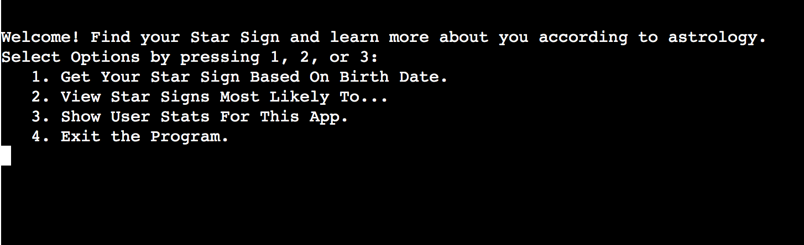
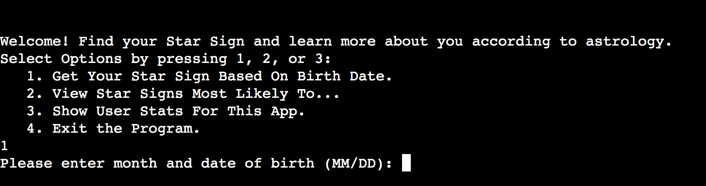
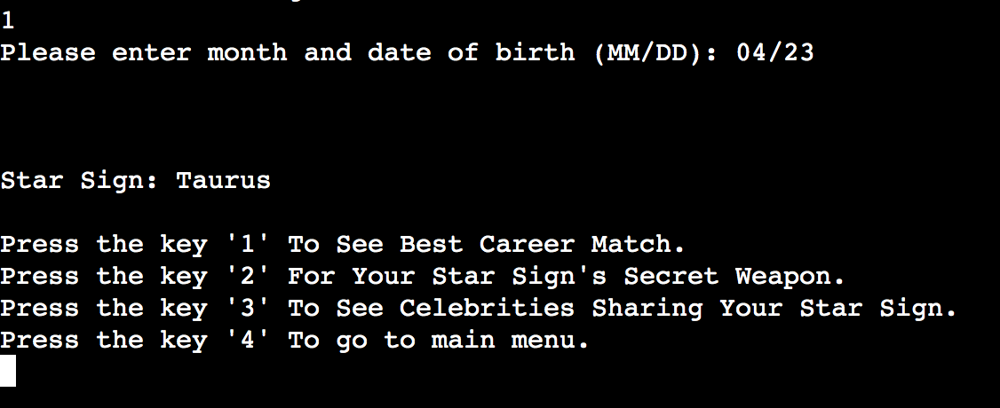
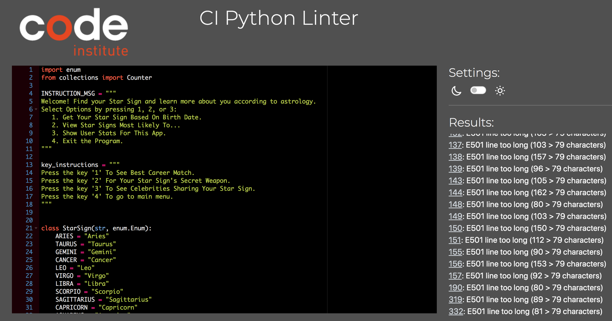

# Find Your Star Sign

[VIEW APP HERE](https://starsign.herokuapp.com/)

Starsign is a command-line program to see what your star sign is by adding your birth month and date. You can also learn more about your star sign and learn facts about other star signs. 

## How it works

When the user enters the program a welcome message asks user to choose one of four alternatives. 

   1. Get Your Star Sign Based On Birth Date.
   2. View Star Signs Most Likely To...
   3. Show User Stats For This App.
   4. Exit the Program.

### 1. Get Your Star Sign Based On Birth Date.

By pressing key 1 the user is asked to input birth month and date in format MM/DD to calculate users star sign. 

A validator checks if the user input is in the correct form and if the dates are valid in order to compute a star sign. If the user inputs invalid information such as letters or a date in the wrong format a error message is displayed that says: Input not valid. The program then urges the user: Please enter month and date of birth (MM/DD): 

When the user inputs MM/DD the program will generate the users star sign and present it on the screen with 4 new options of:

Press the key '1' To See Best Career Match.
Press the key '2' For Your Star Sign's Secret Weapon.
Press the key '3' To See Celebrities Sharing Your Star Sign.
Press the key '4' To go to main menu.

When the user inputs one of the four keys correctly the star sign information related to their choice will generate on the screen along with message ”Press any key to continue…”

When any key is pressed the user gets the menu with the options to:

Press the key '1' To See Best Career Match.
Press the key '2' For Your Star Sign's Secret Weapon.
Press the key '3' To See Celebrities Sharing Your Star Sign.
Press the key '4' To go to main menu.

If the user press ’4’ you return to the main menu.

Welcome! Find your Star Sign and learn more about you according to astrology.
Select Options by pressing 1, 2, or 3:
   1. Get Your Star Sign Based On Birth Date.
   2. View Star Signs Most Likely To...
   3. Show User Stats For This App.
   4. Exit the Program.

### 2. View Star Signs Most Likely To...

When the user inputs 2 to se Star Signs Most Likely To… A menu with four choices generates.

Find What Star Sign Is Most Likely To...
Select by pressing key '1', '2', '3' or '4':
 1. Star Signs Most Likely To Be Serial Killers.
 2. Star Signs Most Likely To Be Billionaires.
 3. Star Signs Most Likely To Be Famous.
 4. Return To Menu

When the user uses key options 1-3 a list with the star signs most likely to, relating to the topic the user has chosen will appear with the menu printed again that allows to choose key to see more Star Sign Is Most Likely To... The user is also given the choice to press 4 and return to main menu. 

### 3. Show User Stats For This App.
The option ’3’ Show user stats is a future feature and is not working at the moment.

### 4. Exit the program.
Program exit when the user presses key 4 in main menu with message: Exiting program

## Future Features
Option ’3’ Show user stats in main menu will show what keys are pressed the most to display a list of most popular options to view and also what star signs are most commonly generated from user input.
Fix long lines and break them up. Better spacing for user readability.

## Techonologies used

- [Python](https://www.python.org)

- [Github](https://github.com/)

- [Git](https://git-scm.com)
To push to github.

- [Heroku](https://heroku.com/)
To deploy project for live viewing.

- [Lucidchart](https://lucid.app/)
Wireframe for project.

- [CI Python Linter](https://pep8ci.herokuapp.com/#)
To find errors.

## Testing

Regular testing has been performed during the development process to catch errors and usability.

The testing has been done to see that validation works. Inputs are working properly. That functions run as they should and the user gets the right message in return when keys are pressed. 

### Known bugs and bug fixes

The option ’3’ Show user stats is a future feature and is not working at the moment.
Long lines that should be broken up in future features.

## Linter Python Testing

The Code institutes [Python Linter tester](https://pep8ci.herokuapp.com/#) 

Error for long lines.

## Deployment

This project was deployed using following steps:

1. Go to Heroku and log in

2. Go to "New" button on Heroku dashboard and select "Create new app".

3. Enter a app name that is available, choose your region and click on ”Create App"

4. Go to settings. Add two build packs in correct order as listed below.

 - Python
 - Nodejs

5. Go to deployment tab.

6. Choose "connect through GitHub" and confirm by clicking the "Connect to GitHub" button 

7. Enter your repository name and then click "Search”. Make sure the spelling is correct to find your repository.

8. Connect repository by clicking the ”Connect" button.

9. Under "Automatic deploys" click the "Enable Automatic Deploys” button. 

10. Under "Manual deploy", choose the main branch and then click the "Deploy Branch" button (Deployment may take a few minutes).

11. Message that the deployment was successful will appear with a link to the live site.

## Credits

Copy for this program:
Best Career Match for your star sign: https://www.theurbanlist.com/a-list/we-reveal-what-job-you-should-be-doing-based-on-your-star-sign
Your Star Sign's Secret Weapon: https://www.horoscope.com/zodiac-signs/gemini
Celebrities that share your sign: https://www.horoscope.com/zodiac-signs/taurus

Star Signs Most Likely to:
NYPOST - https://nypost.com/2022/10/04/four-astrology-signs-linked-with-the-most-known-serial-killers/
BUSINESS INSIDER -  https://www.businessinsider.com/zodiac-signs-with-the-most-billionaires-2019-4?r=US&IR=T#1-libraseptember-23-october-22-1
SOSYNCD -  https://www.sosyncd.com/zodiac-signs-ranked-by-most-likely-to-be-famous/

The Code Institute learning material
- Nested if-else statements
- Multiple Conditions (If/Elif/Else)
- Break, Continue and Pass

My Code Institute mentor Sandeep

stackoverflow.com for better understanging of how and why.

Programming with Mosh on Youtube
